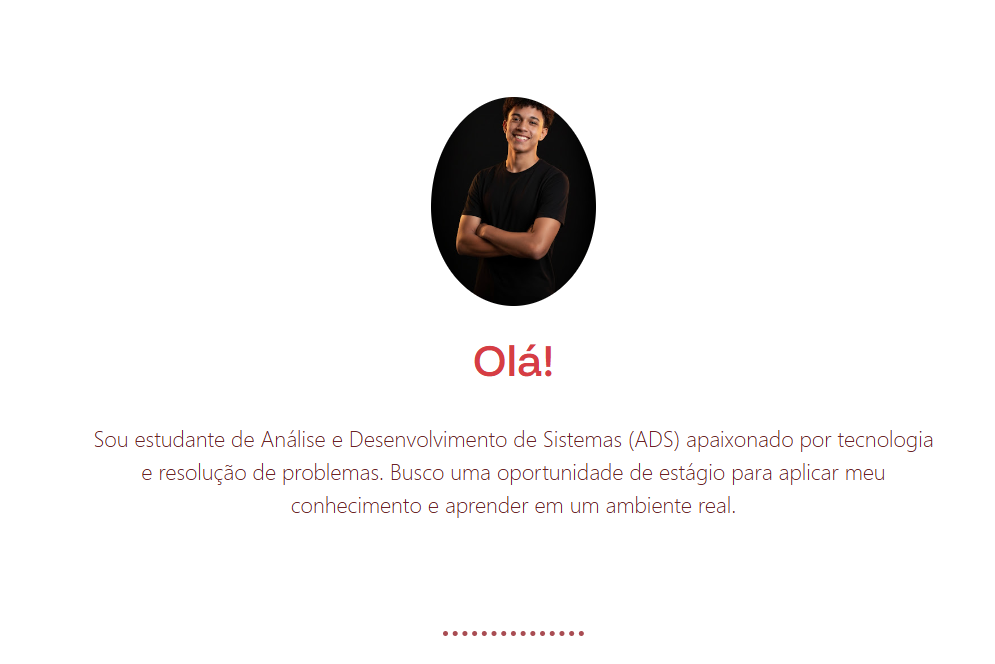

# 🚀 Portfólio Pessoal | Matheus Souza

 

> Este é o meu hub central de projetos. Um portfólio desenvolvido para apresentar minha trajetória de transição da Logística para o Desenvolvimento Web, exibindo minhas habilidades e projetos práticos.

---

## 🖼️ Preview


*(Se a imagem não carregar, certifique-se de que o arquivo existe na pasta assets/images)*

---

## 🛠️ Tecnologias Utilizadas

O projeto foi construído focando em código limpo, semântico e responsivo:

-  **HTML5 Semântico**: Estrutura organizada e acessível.
-  **CSS3 Moderno**: Variáveis CSS (:root), Flexbox e Grid Layout.
-  **Bootstrap 5**: Utilizado para garantir responsividade rápida e componentes visuais (Cards, Botões).
-  **Git & GitHub**: Controle de versão e hospedagem.

---

## ✨ Funcionalidades

- **Design Responsivo:** O layout se adapta perfeitamente a celulares, tablets e desktops.
- **Seção de Skills:** Apresentação visual das competências em Front-end e Dados.
- **Showcase de Projetos:** Cards interativos com links diretos para outros repositórios.
- **Botões de Contato:** Links diretos para LinkedIn e E-mail.
- **Animações Suaves:** Efeitos de hover (passar o mouse) e transições CSS.

---

## 📂 Como rodar o projeto localmente

Se você quiser baixar esse código para estudar ou testar na sua máquina:

1. **Clone o repositório:**
   ```bash
   git clone [https://github.com/devsoouz/projeto_pessoal.git](https://github.com/devsoouz/projeto_pessoal.git)
