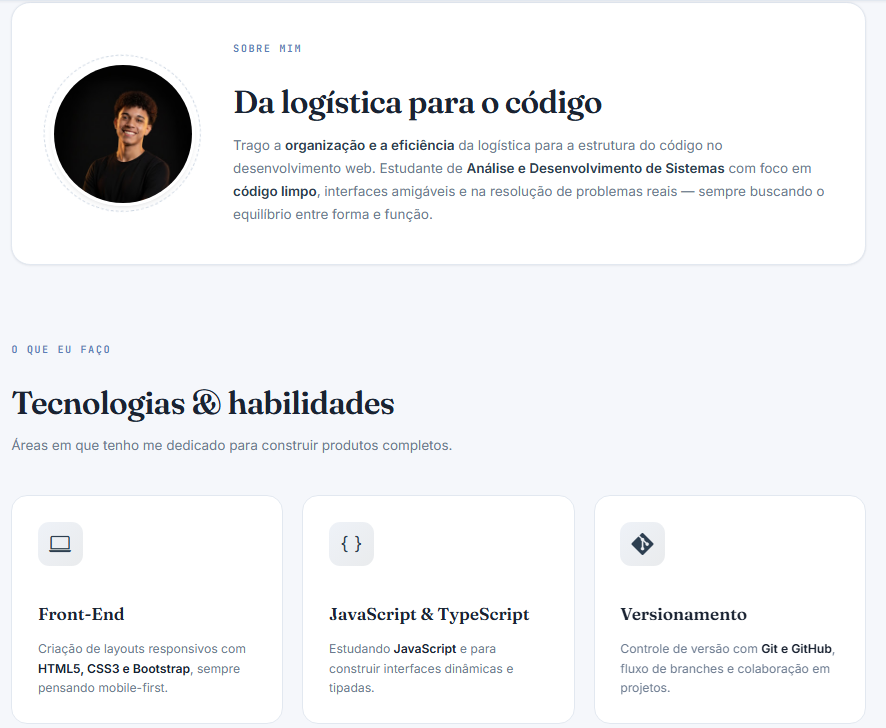

# 🏔️ Portfólio — Matheus Souza

 

> Site de apresentação pessoal feito para praticar **HTML5, CSS3 e design de interfaces**. Trazendo organização da Logística para o desenvolvimento web.

🔗 **Acesse o site:** [coloque-aqui-o-link-do-deploy.com](#)

---

## 📸 Preview



> 

---

## 🎯 Objetivo

Este projeto foi criado para:

- Praticar **HTML5 semântico** e organização de código
- Aplicar **CSS3 moderno** (variáveis, Flexbox, Grid, animações)
- Treinar **design responsivo** mobile-first
- Construir uma vitrine pessoal para mostrar meus projetos
- Documentar meu progresso na transição de carreira

---

## 🛠️ Tecnologias


- **HTML5 semântico** — `header`, `main`, `section`, `article`, `nav`, `footer`
- **CSS3 moderno** — variáveis CSS, Grid, Flexbox, animações
- **JavaScript vanilla** — navbar dinâmica no scroll
- **Google Fonts** — Fraunces (display) + Inter (texto) + JetBrains Mono (mono)
- **Bootstrap Icons** — ícones via CDN

---

## ✨ Funcionalidades

- ✅ Layout 100% responsivo (mobile, tablet, desktop)
- ✅ Navbar fixa com efeito glassmorphism ao rolar
- ✅ Animações de entrada suaves
- ✅ Indicador "Disponível para oportunidades"
- ✅ Cards de projetos com hover interativo
- ✅ Seção de contato em destaque
- ✅ Meta tags para SEO e Open Graph

---

## 📂 Estrutura do projeto

```
projeto_pessoal/
├── assets/
│   ├── css/
│   │   └── styles.css
│   └── images/
│       ├── math_profissional.jpg
│       ├── montanha.jpg
│       ├── projeto-pessoal.png
│       └── wikipédia-clone.png
├── index.html
└── README.md
```

---

## 🚀 Como rodar localmente

1. **Clone o repositório:**

   ```bash
   git clone https://github.com/devsoouz/projeto_pessoal.git
   ```

2. **Entre na pasta:**

   ```bash
   cd projeto_pessoal
   ```

3. **Abra o `index.html`** no navegador.
   _Dica: se usar VS Code, instale a extensão **Live Server** e clique em "Go Live"._

---

## 📚 O que aprendi neste projeto

- Organização de variáveis CSS para criar um **design system** mínimo
- Uso de **CSS Grid** e **Flexbox** para layouts complexos
- Aplicação de **tipografia hierárquica** com fontes serifadas e sem serifa
- Importância de **acessibilidade** (alt em imagens, aria-label em ícones)
- **Mobile-first**: pensar primeiro no mobile e expandir para desktop
- Resolução de **conflitos de merge** no Git

---

## 🔮 Próximos passos

- [ ] Adicionar modo escuro (dark mode)
- [ ] Implementar formulário de contato funcional
- [ ] Adicionar mais projetos conforme estudo
- [ ] Migrar para React e componentizar o portfólio
- [ ] Otimizar imagens para WebP
- [ ] Deploy automatizado via GitHub Pages ou Vercel

---

## 📬 Contato

- 💼 **LinkedIn:** [matheus-silva-souza-devz](https://www.linkedin.com/in/matheus-silva-souza-devz)
- 🐙 **GitHub:** [@devsoouz](https://github.com/devsoouz)

---

## 📝 Licença

Este projeto está sob a licença MIT.

---

<p align="center">
  Feito com ☕ por <strong>Matheus Souza</strong>
</p>
